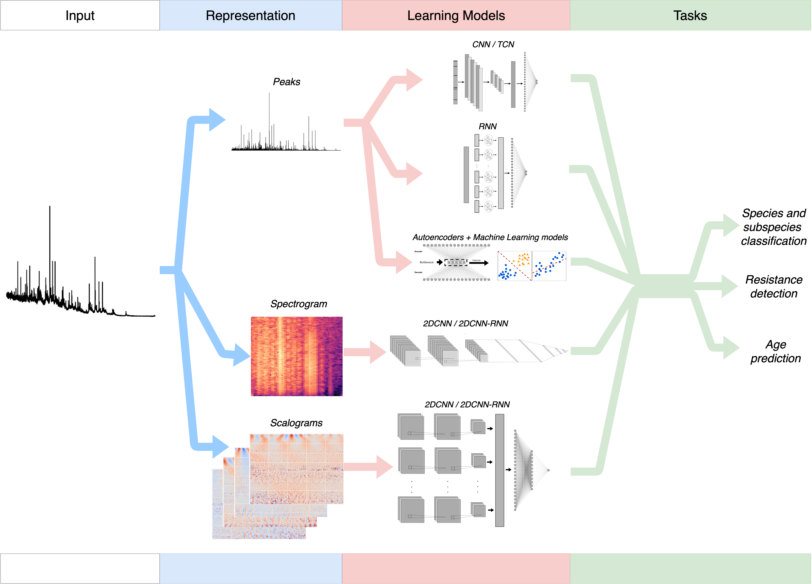

# Epidemiology_DeepLearning_MALDI_Mohammad_et_al
🚧👷🏽‍♀️Repository in progress🛠️🚜  
This repository contains the code and resources for the article "Exploring Deep Learning Models for Analyzing MALDI-TOF Spectra for Infectious Disease Epidemiology" by Mohammad et al. (currently being submitted). The project focuses on leveraging all deep learning techniques tested to analyze MALDI-TOF mass spectrometry data, aiming to enhance the understanding and monitoring of infectious diseases.

## Contents:

- Data preprocessing scripts
- Deep learning model implementations
- Training and evaluation workflows
- Example datasets
- Documentation and usage instructions

## Goals:

- Develop robust deep learning models for MALDI-TOF spectral analysis
- Improve accuracy in detecting and characterizing infectious agents
- Provide tools for epidemiological research and public health surveillance
- Feel free to explore, contribute, and use the resources provided to advance research in infectious disease epidemiology.

